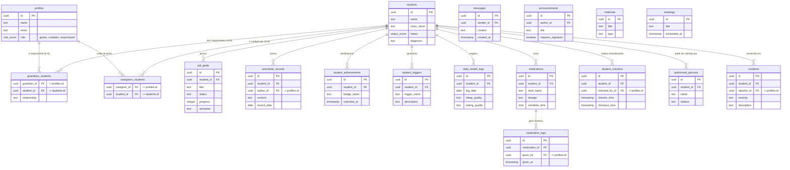

```mermaid
erDiagram
    %% Core Entities
    profiles {
        uuid id PK
        text name
        text email
        role_enum role "gestor, cuidador, responsavel"
    }

    students {
        uuid id PK
        text name
        text class_name
        status_enum status
        text diagnosis
    }

    %% Junction Tables (Vínculos)
    guardians_students {
        uuid guardian_id FK "-> profiles.id"
        uuid student_id FK "-> students.id"
        text relationship
    }

    caregivers_students {
        uuid caregiver_id FK "-> profiles.id"
        uuid student_id FK "-> students.id"
    }

    %% PDI & Evolução
    pdi_goals {
        uuid id PK
        uuid student_id FK
        text title
        text status
        integer progress
        text semester
    }

    anecdotal_records {
        uuid id PK
        uuid student_id FK
        uuid author_id FK "-> profiles.id"
        text content
        date record_date
    }

    student_achievements {
        uuid id PK
        uuid student_id FK
        text badge_name
        timestamp unlocked_at
    }

    student_triggers {
        uuid id PK
        uuid student_id FK
        text trigger_name
        text description
    }

    %% Saúde e Medicação
    daily_health_logs {
        uuid id PK
        uuid student_id FK
        date log_date
        text sleep_quality
        text eating_quality
    }

    medications {
        uuid id PK
        uuid student_id FK
        text med_name
        text dosage
        time schedule_time
    }

    medication_logs {
        uuid id PK
        uuid medication_id FK
        uuid given_by FK "-> profiles.id"
        timestamp given_at
    }

    %% Segurança e Portaria
    student_checkins {
        uuid id PK
        uuid student_id FK
        uuid checked_by_id FK "-> profiles.id"
        timestamp checkin_time
        timestamp checkout_time
    }

    authorized_persons {
        uuid id PK
        uuid student_id FK
        text name
        text relation
    }

    incidents {
        uuid id PK
        uuid student_id FK
        uuid reporter_id FK "-> profiles.id"
        text severity
        text description
    }

    %% Comunicação
    messages {
        uuid id PK
        uuid sender_id FK
        text content
        timestamp created_at
    }

    announcements {
        uuid id PK
        uuid author_id FK
        text title
        boolean requires_signature
    }

    materials {
        uuid id PK
        text title
        text type
    }

    meetings {
        uuid id PK
        text title
        timestamp scheduled_at
    }

    %% Relacionamentos
    profiles ||--o{ guardians_students : "é responsável (N:N)"
    students ||--o{ guardians_students : "tem responsáveis (N:N)"
    
    profiles ||--o{ caregivers_students : "cuida de (N:N)"
    students ||--o{ caregivers_students : "é cuidado por (N:N)"

    students ||--o{ pdi_goals : "possui"
    students ||--o{ anecdotal_records : "possui"
    students ||--o{ student_achievements : "desbloqueia"
    students ||--o{ student_triggers : "apresenta"

    students ||--o{ daily_health_logs : "registra"
    students ||--o{ medications : "toma"
    medications ||--o{ medication_logs : "gera histórico"

    students ||--o{ student_checkins : "realiza entrada/saída"
    students ||--o{ authorized_persons : "pode ser retirado por"
    students ||--o{ incidents : "envolvido em"

```
